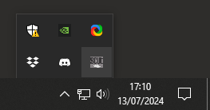
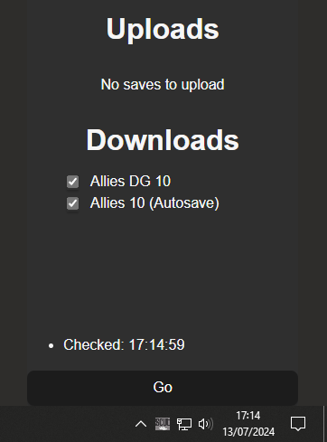

# SCUT

> Strategic Command Utility Tool

A program to upload and download SC saves to/from remote shares like dropbox.

## User Guide

### Installation

A Windows installer can be downloaded from [GitHub Releases](https://github.com/drmason13/scut/releases).

SCUT will prompt you to install updates when they are available.

### Configuration

SCUT will prompt you for some input to create a config file when run for the first time:

```
What side will you be playing as?
Allies
How do you want to sign your saves?
DM
New config written to C:\Users\you\AppData\Roaming\scut\config.toml
```

The SCUT config file looks something like this:

```
saves = 'C:\Users\masond\Documents\My Games\Strategic Command WWII - World at War\Multiplayer\Hotseat'
side = "Allies"
player = "GM"
dropbox = 'C:\Users\masond\Dropbox\SC WW1'
seven_zip_path = 'C:\Program Files\7-Zip\'
```

You can open the file with a text editor (e.g. notepad) and edit it to change things if needed.

The SCUT config file is in TOML format, which is fairly intuitive. Just be sure to use single quotes `'` when any `\` characters are used in Windows paths.

#### saves
Your saves are placed here to be read by Strategic Command.
This location is hardcoded relative to your Documents folder, which is detected automatically.
Make sure this is where Strategic Command expects save games to be. 

#### side
Your side in the game, currently this has to be either `Allies` or `Axis`,
even if you're playing a non-WW2 scenario with different team names.
`Axis` is the team that goes first.

#### player
Your name as used by SCUT when reading save game names.
You should use this name in any save game you create so that SCUT knows the save is yours.
e.g. `Axis DM 1` would be the first turn for the player `DM` who is playing as the `Axis`.

#### dropbox
Your dropbox path is detected automatically but you will likely want to edit it anyway to point to a folder inside where everyone playing has access to.

#### seven_zip_path
This is the path to a program called [7-Zip]() that SCUT uses to compress and decompress the saves.
SCUT assumes that 7-Zip is located in `C:\Program Files` but if it isn't for any reason, then set this accordingly to the folder that contains a `7z.exe` executable.

#### turn
In previous versions of SCUT, the current `turn` was tracked in the config.
This setting is now ignored if present.

### Usage

Just run `scut.exe` to download or upload saves. It will try and figure out what to do by itself.

```
Will download:
  ⬇️ Allies DG 10
  ⬇️ Allies 10 (autosave)

Is that OK?: [Y] / N
```
Press enter to accept and download (or upload) the saves as described,
or type `N` and then press enter to decline and do nothing.

#### Example of cancelling
```
Is that OK?: [Y] / N
N
User cancelled. Stopping.
<Press Enter to exit>
```

#### Using the GUI
You can run `scut.exe --background` to start a desktop tray app on Windows.

Click on the SCUT icon in the bottom right (you might need to expand the caret to see it)



This should open a small window showing what scut has planned.



You can click checkboxes to toggle which saves you want to upload/download.

Hit the big wide button at the button to **Go** do it.

#### Make SCUT run at startup

Running SCUT as a tray app on startup is convenient.

To do so, Go to Start > Settings > Apps > Startup.

## Developer Guide

## Release

> this is for developers looking to publish a new version of scut

To ship a new version of scut run the justfile!

```sh
just release
```

> NOTE: scut's justfile uses [nushell](https://www.nushell.sh/book/installation.html) to run commands, you can install it on windows and linux

This will...
  * update the package.version in scut* Cargo.toml files
  * add a commit to git with the version as the message
  * tag that commit

you will be prompted for a git tag message which is used to create release notes:

example tag message:
```
v0.4.4

* automate release process
* documentation for users and developers in github README.md
```

  * build the tauri app (*you will need to enter the password to sign it using your key*)
  * upload it to [GitHub Releases](https://github.com/drmason13/scut/releases) using the gh CLI (*requires a GitHub Personal Access Token at `~/.github/scut_pat.token`*)
  * update the url in the [JSON hosted as GitHub gist](https://gist.github.com/drmason13/27d0e797ea86132427cbc7674298e612/edit)
